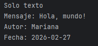
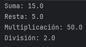

# Ejercicios de Patrones y Principios SOLID

## Ejercicio 1 – Patrón Creacional (Factory Method)

**Enunciado:**  
Una aplicación necesita crear diferentes tipos de notificaciones según el canal de envío.  
Diseñe una solución que permita crear distintos tipos de notificaciones:
- Notificación por correo electrónico
- Notificación por SMS
- Notificación por notificación push

Todas las notificaciones deben poder enviarse, pero la forma de envío cambia según el tipo.  
El sistema debe permitir crear el tipo de notificación sin que el código principal dependa directamente de las clases concretas.

**Resultado:**  

---

## Ejercicio 2 – Patrón Estructural (Adapter)

**Enunciado:**  
En la aplicación existen dos clases que imprimen mensajes, pero lo hacen de manera distinta:
- Clase A (impresora simple): imprime únicamente el texto del mensaje en consola.
- Clase B (impresora detallada): imprime el mensaje incluyendo información adicional (texto, autor, fecha).

El sistema fue diseñado para trabajar solo con la impresora simple, por lo que no puede usar directamente la impresora detallada.  
Diseñe una solución que permita que el sistema pueda utilizar ambos tipos de impresoras sin modificar ninguna de las clases existentes, usando un Adapter.

**Resultado:**  

---

## Ejercicio 3 – Patrón de Comportamiento (Memento)

**Enunciado:**  
Un editor sencillo permite modificar el contenido de un texto, pero se quiere agregar la opción de deshacer cambios.  
Diseñe un sistema que permita guardar el estado de un texto antes de ser modificado y restaurarlo cuando el usuario lo solicite.

El sistema debe permitir:
- Guardar el estado actual del texto en una estructura de datos (lista)
- Restaurar un estado anterior sin exponer los detalles internos del objeto que contiene el texto.

**Resultado:**  

---

## Ejercicio 4 – Principios SOLID (Calculadora simple)

**Enunciado:**  
Se desea construir una calculadora básica, pero bien diseñada.

Implemente una calculadora que pueda realizar las siguientes operaciones:
- Suma de números enteros y decimales
- Resta de números enteros y decimales
- Multiplicación de números enteros y decimales
- División de números enteros y decimales

Cada operación debe estar separada de la calculadora principal, de manera que agregar una nueva operación no implique modificar el código existente.  
Aplicar Responsabilidad Única, Abierto/Cerrado, Liskov substitution e Interface Segregation.

**Resultado:**  

---

## Reflexión
- **¿Qué entendía mal antes?**

Pensaba que era suficiente con hacer funcionar el código, sin preocuparme por la estructura ni la flexibilidad para cambios futuros.

- **¿Qué entiendo ahora?**

Los patrones permiten soluciones flexibles, extensibles y mantenibles, y evitan "código rígido".

- **¿Qué me falta reforzar?**

Practicar más aplicaciones de cada patrón en diferentes contextos y lenguajes.
  