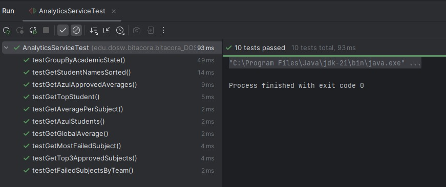
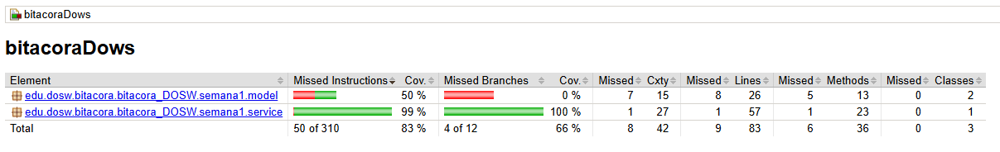

# SEMANA 1 - DESAFÍO DE CÓDIGO

---

## Ejercicios realizados

1. Obtener todos los estudiantes del equipo AZUL.
2. Obtener todos los nombres de estudiantes ordenados alfabéticamente.
3. Calcular el promedio general de todos los scores existentes.
4. Retornar por estudiante el promedio por materia: Map<String, Double>.
5. Retornar el estudiante con mayor promedio general.
6. Retornar las materias reprobadas por equipo: Map<String, Long>.
7. Top 3 estudiantes con más materias aprobadas.
8. Agrupar estudiantes por estado académico:
    - ALTO RENDIMIENTO (promedio >= 4.5)
    - REGULAR (promedio entre 3.5 y 4.49)
    - RIESGO (promedio < 3.5)
9. Obtener la materia con más reprobaciones.
10. Para estudiantes del equipo AZUL: filtrar notas aprobadas, agrupar por materia, calcular promedios, ordenar descendente y retornar un LinkedHashMap.

---

## Evidencias de la semana

- **Actividades realizadas:** Implementación de modelos, lógica funcional, pruebas unitarias y reporte de cobertura.
- **Dificultades:** Adaptación de lógica a programación funcional, uso correcto de streams y cobertura de pruebas.
- **Gestión del tiempo:** Aproximadamente 2 horas, en código, pruebas y configuración para medir la cobertura.
- **Reflexión:**
Esta semana aprendí la importancia de la programación funcional en Java usando Streams, así como las ventajas de estructurar el proyecto correctamente con Maven y aplicar Git Flow. Al diseñar las pruebas unitarias, comprendí cómo asegurar calidad y mantenibilidad en el código, asegurando una cobertura mínima del 80%. El proceso fue enriquecedor, ya que favoreció la claridad del proyecto y el trabajo colaborativo profesional, permitiendo detectar y resolver errores oportunamente.

- **Evidencias:** 

Resultado Tests:

Para la cobertura se hace:
   1. mvn test

   2. mvn jacoco:report
   
   3.Buscar el reporte generado aquí: target/site/jacoco/index.html

Resultado Cobertura:

El reporte de JaCoCo muestra una cobertura total del 83%, superando el mínimo exigido (80%). La clase principal de lógica funcional tiene 99% de cobertura, lo que garantiza la calidad y pruebas sobre casi todo el código productivo.
