## Semana 3
### Factory Method comercio electronico 
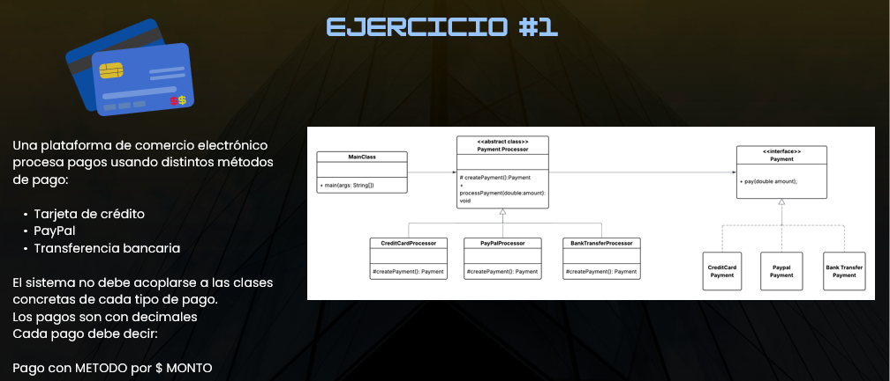
### Resultado:
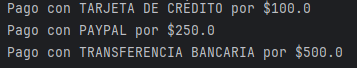
### Abstract Factory - Empresa de Videojuegos (Xbox y PlayStation)
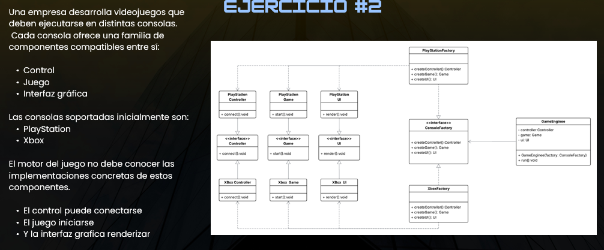
### Resultado: 
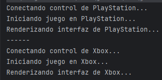
### Builder - Fabrica de juguetes
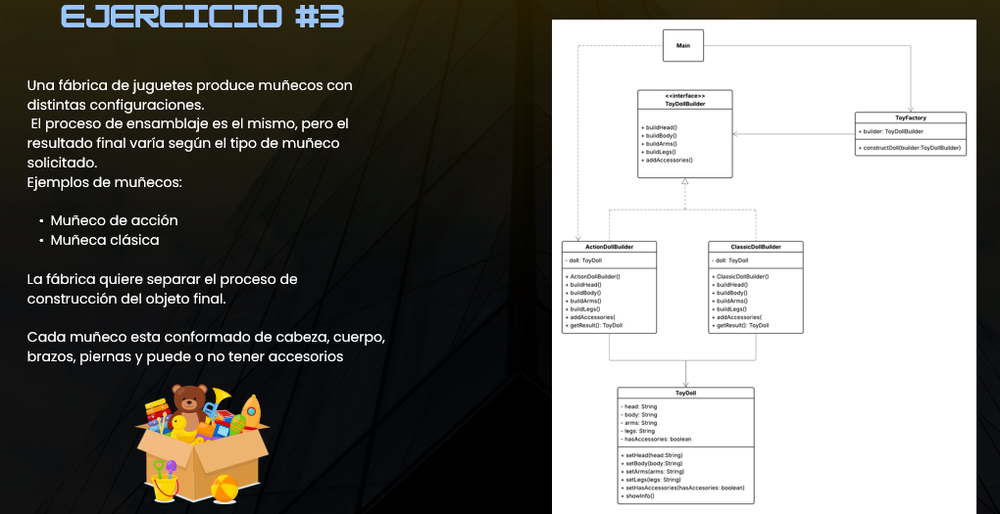
### Resultado:
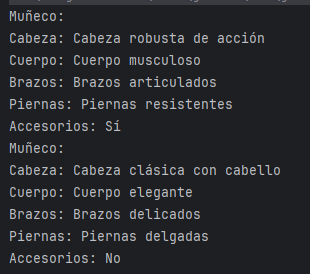
### Adapter - Gasolineria Inteligente
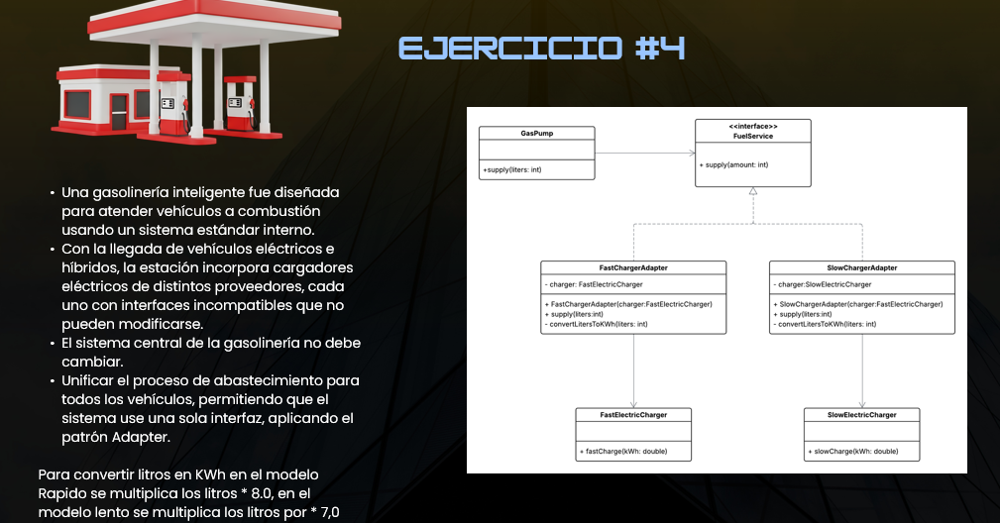
### Resultado:
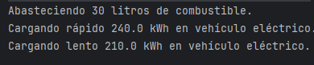
### Bridge - Figuras y Colores
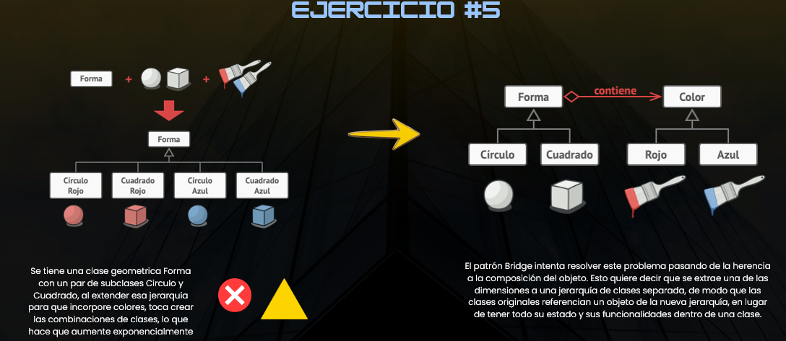
### Resultado:
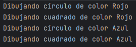
### Composite - Bodega de productos
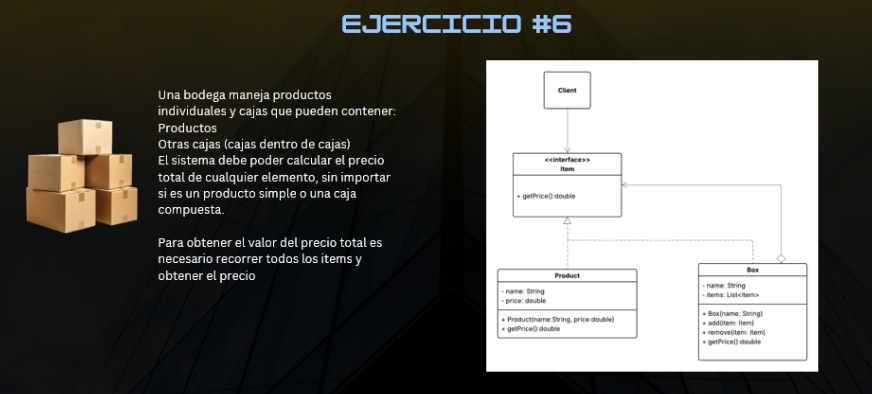
### Resultado:
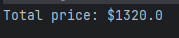
### Decorador - Simulador de batalla naval
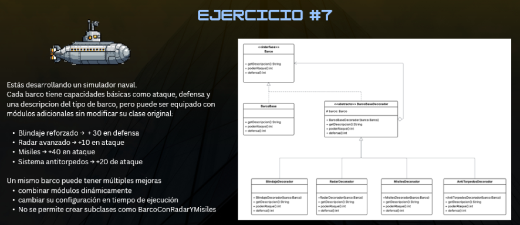
### Resultado:
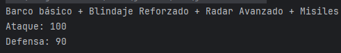
### Chain of responsability - Embajada de estados unidos
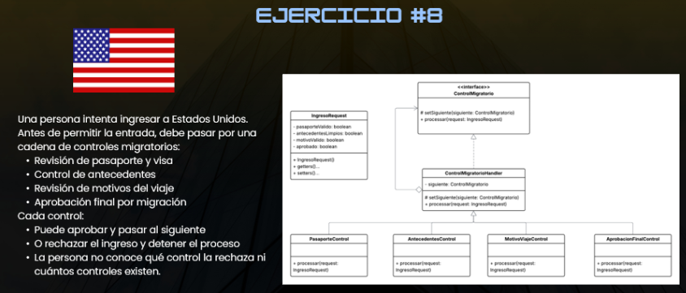
### Resultado:
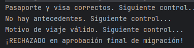
### Command - Personajes de videojuegos
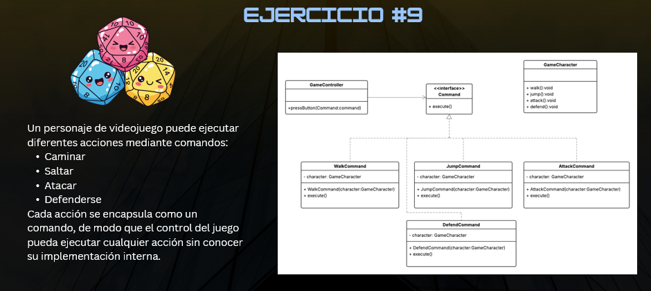
### Resultado:
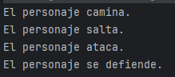
### Iterator - Viaje a roma (diagrama)
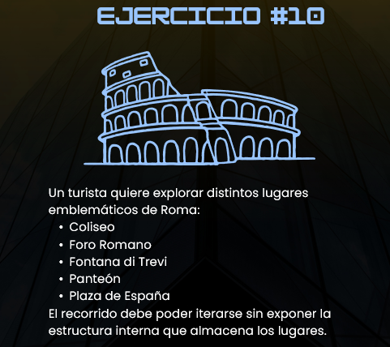
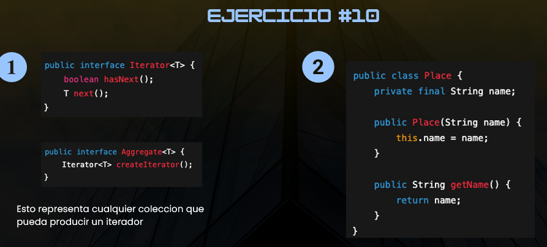
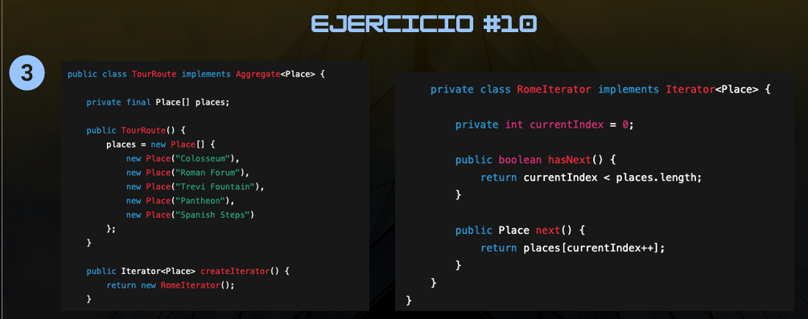
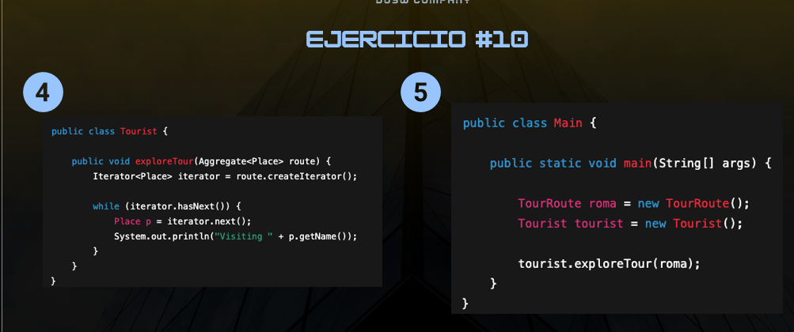
### Resultado:
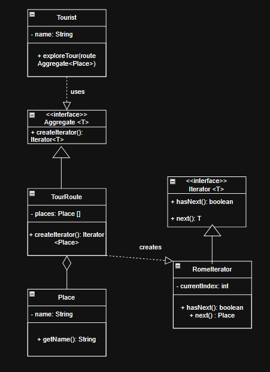
### Strategy - Aplicacion de navegacion
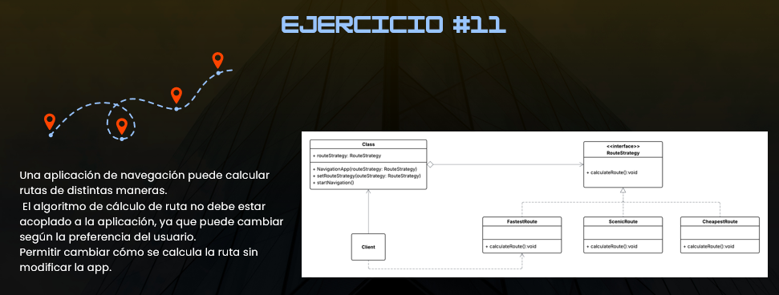
### Resultado: 
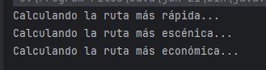

### Reflexión: 
¿Qué entendía mal antes?

No tenía muy claro que cada diseño manejaba diferentes relaciones entre sus interfaces, o que se necesitaba una.

¿Qué entiendo ahora?

Ahora entiendo que cada diseño tiene una función diferente, y que se necesitan para resolver diferentes problemas, y que cada uno tiene sus ventajas y desventajas.

¿Qué me falta reforzar?

Me falta reforzar el conocimiento de cada diseño, y saber cuándo usar cada uno, y cómo implementarlos correctamente.