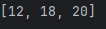
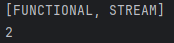

# Semana 1
## Ejercicio 1: Números pares mayores a 10
### Lista de ejemplo:
List<Integer> numbers = List.of(3,8,10,12,15,18,20);
### Resultado:

### Ejercicio 2: Palabras con más de 4 letras, en mayúsculas y ordenadas alfabéticamente.
### También la cantidad de palabras
### Lista de ejemplo:
List<String> words = List.of("java", "stream", "api", "functional", "code", "git");
### Resultado:

