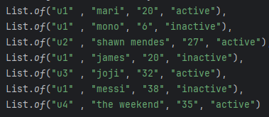
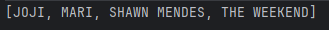
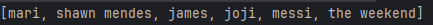
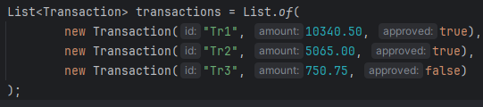
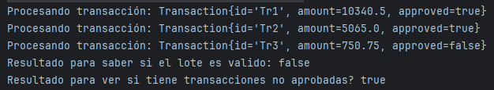

# Semana 1
## Ejercicio 1: Números pares mayores a 10
## Lista de ejemplo:
List<Integer> numbers = List.of(3,8,10,12,15,18,20);
## Resultado:

## Ejercicio 2: Palabras con más de 4 letras, en mayúsculas y ordenadas alfabéticamente.
#### También la cantidad de palabras
## Lista de ejemplo:
List<String> words = List.of("java", "stream", "api", "functional", "code", "git");
## Resultado:

## Ejercicio 3: Dada lista de usuarios con id, nombre, edad y estado (activo/inactivo),obtener el nombre de los usuarios activos en mayúsculas y en orden alfábetico
## Lista de ejemplo:

## Resultado:

## Ejercicio 4: Dada una lista de usuarios con id, nombre, categoría y precio, obtener el nombre de los adultos
## Lista de ejemplo:

## Resultado:

## Ejercicio 5: Dada una lista de transacciones bancarias representadas por objetos Se requiere procesar la lista usando Streams para:
Usar peek para ver cada transacción procesada (Utilizar System.out.println para ver la transaccion)
Verificar si existe al menos una transacción no aprobada
Retornar true o false indicando si el lote de transacciones es válido.
## Lista de ejemplo:

## Resultado:

