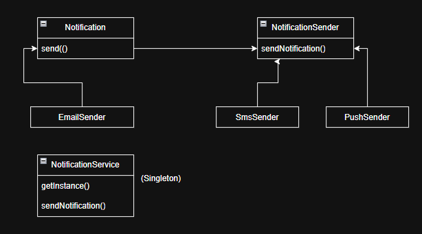

# Ejercicio 1: Sistema de Notificaciones

## Patrones de Diseño Utilizados

### 1. Strategy
- **Tipo:** Comportamiento
- **Justificación:** Permite cambiar dinámicamente el canal de notificación (Email, SMS, Push) sin modificar el código del cliente. Facilita la extensión para nuevos canales.

### 2. Singleton
- **Tipo:** Creacional
- **Justificación:** Garantiza que el servicio centralizado de envío de notificaciones tenga una única instancia en todo el sistema, evitando duplicidad y problemas de concurrencia.

## Diagrama de Clases

- **NotificationSender**: Interfaz Strategy para los canales.
- **EmailSender, SmsSender, PushSender**: Implementaciones concretas del canal.
- **NotificationService**: Singleton que gestiona el envío.
- **Notification**: Clase que usa el Strategy y el Singleton.

### Pruebas:

