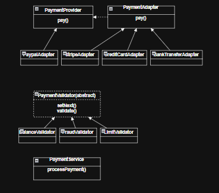

# Ejercicio 2: Sistema de Procesamiento de Pagos

## Patrones de Diseño Utilizados

### 1. Adapter
- **Tipo:** Estructural
- **Justificación:** Permite integrar proveedores de pago externos con interfaces diferentes (PayPal, Stripe, Tarjeta de crédito, Transferencia bancaria) al sistema interno, sin modificar el código principal. Así, se pueden agregar nuevos proveedores fácilmente.

### 2. Chain of Responsibility
- **Tipo:** Comportamiento
- **Justificación:** Permite encadenar validaciones (saldo, fraude, límite, etc.) de forma flexible, agregando o quitando validadores sin modificar la lógica principal. Cada validador decide si el proceso continúa o se detiene.

## Diagrama de Clases UML

- **PaymentProvider**: Interfaz interna del sistema.
- **PaymentAdapter**: Adaptador base para proveedores externos.
- **PaypalAdapter, StripeAdapter, etc.**: Adaptadores concretos.
- **PaymentValidator**: Clase abstracta para la cadena de validaciones.
- **BalanceValidator, FraudValidator, LimitValidator**: Validadores concretos.
- **PaymentService**: Orquestador del proceso de pago.

## Ejecución de pruebas y cobertura

### Pruebas unitarias
